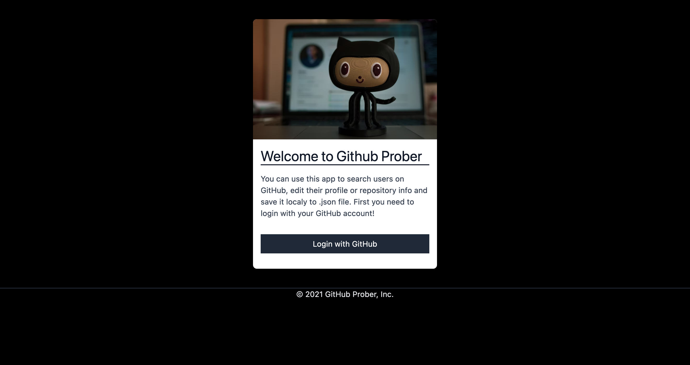
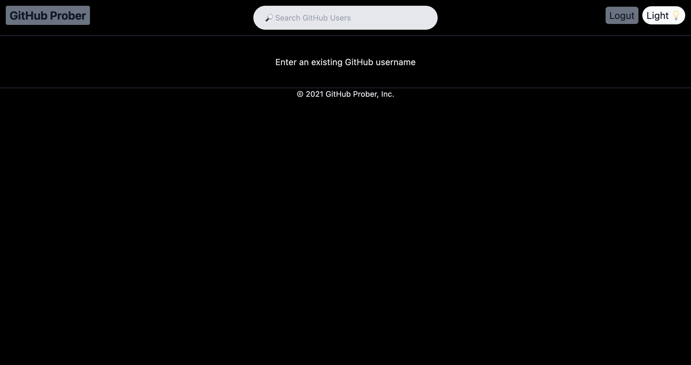
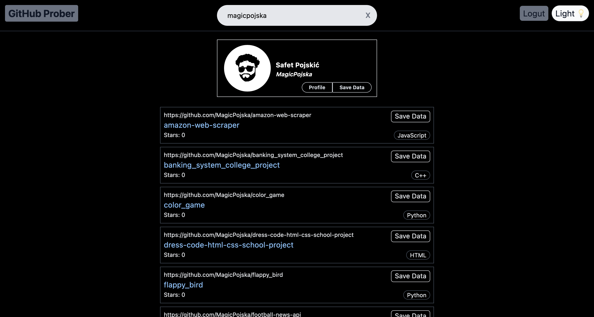
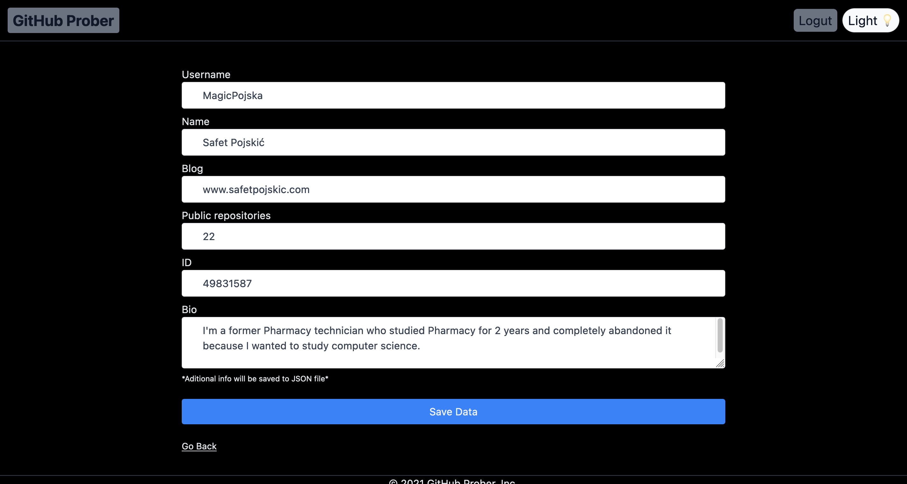
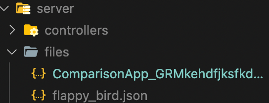
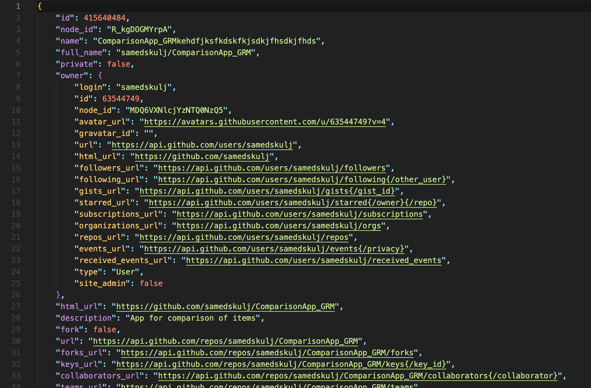

<div id="top"></div>

<!-- PROJECT LOGO -->
<br />
<div align="center">
  


  <h3 align="center">GitHub Prober</h3>

  <p align="center">
    Project that will help you with browsing GitHub!
  </p>
</div>


<!-- TABLE OF CONTENTS -->
<details>
  <summary>Table of Contents</summary>
  <ol>
    <li>
      <a href="#about-the-project">About The Project</a>
      <ul>
        <li><a href="#built-with">Built With</a></li>
      </ul>
    </li>
    <li>
      <a href="#getting-started">Getting Started</a>
      <ul>
        <li><a href="#prerequisites">Prerequisites</a></li>
        <li><a href="#installation">Installation</a></li>
      </ul>
    </li>
    <li><a href="#usage">Usage</a></li>
  </ol>
</details>


<!-- ABOUT THE PROJECT -->
## About The Project

This is a project built for searching GitHub users and their repositories. After a successful login you will be greeted with a navbar and within it an input field for searching. Try searching some of your favourite GitHub users. You don't have to press enter because I used debounce to submit your search term every 700ms after the typing stops.
 <br />
 
 ### Root directory layout

    .
    ├── client   
    ├── server
    └── README.md
    
  
<br />
  
### Client directory layout

    .
    ├── public
    ├── src
    ├── .gitignore
    ├── craco.config.js
    ├── package.lock.json
    ├── package.json
    └── tailwind.config.js

<br />
  
### SRC directory layout

    .
    ├── components
    ├── context
    ├── App.jsx
    ├── index.css
    └── index.js
    
<br />
  
### Server directory layout

    .
    ├── controllers
    ├── files
    ├── routes
    ├── .gitignore
    ├── index.js
    ├── package.lock.json
    └── package.json
    

<p align="right">(<a href="#top">back to top</a>)</p>


### Built With

* [React.js](https://reactjs.org/)
* [Tailwind](https://tailwindcss.com/)
* [NodeJS](https://nodejs.org/en/)
* [ExpressJS](https://expressjs.com/)
* [GitHub OAuth](https://docs.github.com/en/developers/apps/building-oauth-apps/authorizing-oauth-apps)
* [ExpressJS](https://expressjs.com/)
* [Axios](https://www.npmjs.com/package/axios)
* [React Loader Spinner](https://www.npmjs.com/package/react-loader-spinner)
* [Use Debounce](https://www.npmjs.com/package/use-debounce)
* [Cookie Parser](https://www.npmjs.com/package/cookie-parser)
* [JsonWebToken](https://www.npmjs.com/package/jsonwebtoken)
* [Nodemon](https://www.npmjs.com/package/nodemon)
* [Dotenv](https://www.npmjs.com/package/dotenv)

<p align="right">(<a href="#top">back to top</a>)</p>


<!-- GETTING STARTED -->
## Getting Started

### Prerequisites

Install NPM
* npm
  ```sh
  npm install npm@latest -g
  ```

### Preparation


1. Login to your GitHub account, go to settings, then Developer Settings and make a new GitHub App. <br />
Type the Homepage URL: http://localhost:3000 <br />
Type the Callback URL: http://localhost:8080/auth/github <br />
Uncheck WebHook! After that save your Client ID and Generate new client secret key and save that one too. 
2. Go to settings again, then Developer Settings and then Personal Access Tokens and generate a new one and save it.
3. Clone the repo
   ```sh
   git clone https://github.com/MagicPojska/github-prober.git
   ```
4. Go inside server folder
   ```sh
   cd server
   ```
5. Install NPM packages
   ```sh
   npm install
   ```
6. Make .env file and paste your Client ID, Client secret and a new secret key(it can be anything you want) in variables like this: <br />
    GITHUB_CLIENT_ID = Your Client ID <br />
    GITHUB_CLIENT_SECRET = Your Client Secret <br />
    SECRET = Your secret key <br />
7. Start server
   ```sh
   npm start
   ```
8. Go back to root folder and enter client folder
   ```sh
   cd ..
   cd client
   ```
9. Install NPM packages
   ```sh
   npm install
   ```
10. Make .env file and paste your Client ID again and Personal Access Token in variables like this: <br />
    REACT_APP_GITHUB_CLIENT_ID = Your Client ID <br />
    REACT_APP_GITHUB_PERSONAL_ACCESS_TOKEN = Your Personal Access Token <br />
7. Start client
   ```sh
   npm start
   ```

<p align="right">(<a href="#top">back to top</a>)</p>


<!-- USAGE EXAMPLES -->
## Usage

Login screen:


After the login screen you will be greeted with an emtpy homepage:


After you enter a search term results will be shown like this:


After you click on Edit Data button you will get a form with inputs from that profile or repo you clicked on:


After you click save your json file will be created at ./server/files folder. Name of the file is generated based on the type of data you saved. If it is a users profile it will be saved as that users username, if it is a repo it will be saved as repo's name:

<br />



<p align="right">(<a href="#top">back to top</a>)</p>


<!-- CONTACT -->
## Contact

Safet Pojskić - pojskicsafet@gmail.com

<p align="right">(<a href="#top">back to top</a>)</p>
# github-prober
